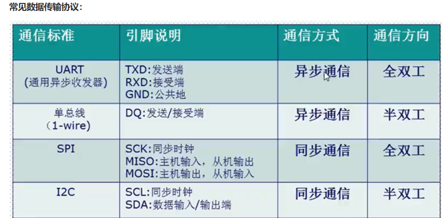
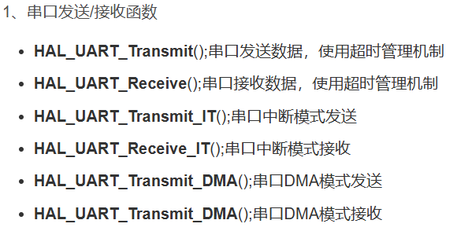
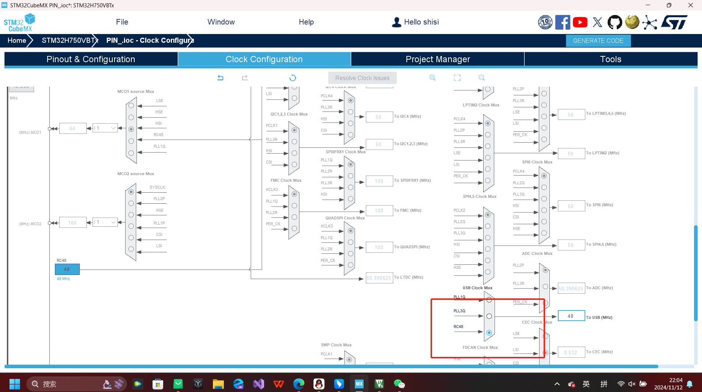
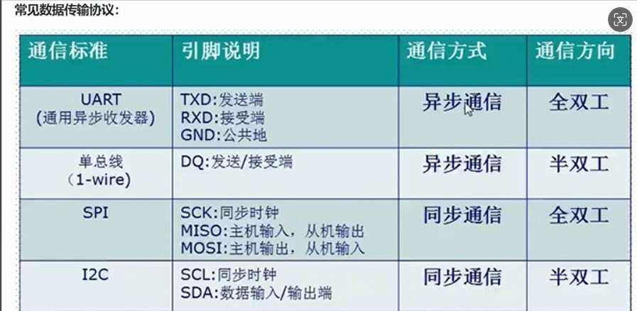

串口的含义：
    串口，即串行接口（Serial Interface），是一种常用的设备通信协议，主要用于逐位传输数据。‌ 串口通信的特点是数据一位接一位地传送，虽然传输速度相对较慢，但传输距离较长。串口通信使用异步传输模式，不需要同步时钟，通过特定的时序来标志传输的开始和结束。‌

    串口的组成包括发送和接收数据线，通常使用三根线：地线、发送线和接收线。串口通信是异步的，可以在一根线上发送数据的同时在另一根线上接收数据，这使得串口非常适合远距离通信。

    串口的应用非常广泛，常用于仪器仪表设备通信、远程采集设备数据获取等。尽管串口通信的速度比并行通信慢，但其简单性和远距离传输的能力使其在许多应用中仍然非常重要。

    UART是通用异步收发器，物理接口形式。
    
    常见数据传输协议：
    
    
    UART结构体定义：
    

    串口发送接收函数：
    
        （1）
        串口发送数据：
        
        （2）
        中断接收数据：
        

操作过程：
    1.设置好stm32：
    
    
    

    2.先写好代码：
    （1）加入头文件
    

    （2）写while里的代码
    
    
    3.先烧代码，然后再接从板输出代码。
    （1）将代码download到主板上面
    （2）USB接口改接从板，按键就可以发送
    